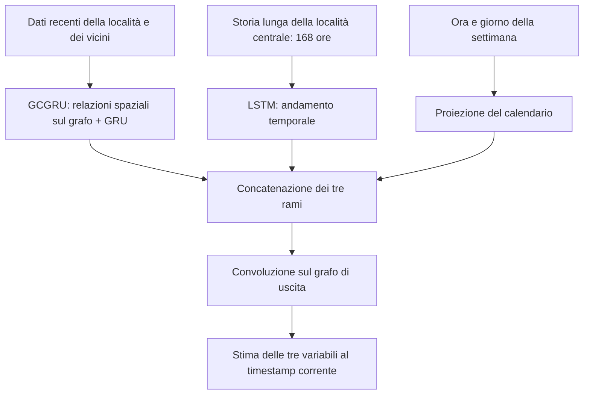

# STGAN: flusso della baseline e modifica CNN

STGAN è il **rilevatore di anomalie**: usa irradianza, temperatura e vento per
stimare quanto una situazione sia insolita. La previsione della produzione
fotovoltaica valutata con MAE/RMSE appartiene invece al modello SDE-Net.
Qui la baseline è l'implementazione GCN-GRU del progetto (`feat/stgan-paper`).

Il **generatore della baseline** combina tre rami:

Il flusso completo prosegue così:

1. **Preparazione:** normalizzazione stimata sul training e costruzione delle
   finestre temporali. La baseline usa la località centrale e otto vicini.
2. **Generatore:** produce i valori attesi di irradianza, temperatura e vento
   per le località della finestra, usando i tre rami sopra.
3. **Discriminatore:** riceve la storia recente insieme al dato corrente,
   reale oppure generato, e impara a distinguerli. Ha un encoder GCGRU per la
   storia e una convoluzione sul grafo per il dato corrente.
4. **Training congiunto:** il generatore impara sia a ricostruire i valori
   osservati sia a rendere plausibili le proprie stime al discriminatore.
5. **Score e decisione:** si combinano l'errore del generatore e la differenza
   fra le risposte del discriminatore al reale e al generato. Dopo la
   normalizzazione dei due contributi, il top-1% globale identifica le anomalie.

**La variante CNN cambia l'elaborazione spaziale.** Nel codice attuale è una
**ConvGRU**: conserva i meccanismi della GRU, ma usa convoluzioni 2D sulla
griglia geografica al posto delle convoluzioni sul grafo.

| Blocco | Baseline | Variante CNN attuale |
|---|---|---|
| Contesto spaziale | Centro + 8 vicini, con grafo | Finestra geografica 3×3, con maschera delle celle presenti |
| Ramo recente del generatore | GCGRU | **ConvGRU** |
| Ramo lungo del generatore | LSTM sulle 168 ore | LSTM sulle 168 ore |
| Calendario | Ora + giorno della settimana | Stesso blocco |
| Uscita del generatore | Convoluzione sul grafo | **Convoluzione 1×1** |
| Storia nel discriminatore | GCGRU | **ConvGRU** |
| Dato corrente nel discriminatore | Convoluzione sul grafo | **Convoluzione 1×1**, con maschera |
| Criterio di training e score | Ricostruzione + confronto avversario | Stesso criterio, calcolato sulle celle valide |

Ai bordi, la finestra CNN può avere meno vicini osservati; le celle assenti
sono mascherate. Con il default di **un solo passo recente**, la ConvGRU
esegue un aggiornamento: la memoria lunga rimane nel ramo LSTM.

**Dopo il detector**, il notebook posthoc applica il filtro qualità PVGIS:
esclude gli azzeramenti solari regionali anomali e l'ora successiva, ricalcola
il top-1% sui punti validi e associa le etichette alle previsioni SDE-Net.
È questo passaggio che alimenta i grafici MAE/RMSE quality filtered; non è
un blocco interno della CNN.

Riferimenti: [workflow CNN](../notebooks/stgan_cnn_pvgis_workflow.ipynb),
[posthoc](../notebooks/stgan_pointwise_posthoc_sdenet.ipynb),
[dettagli tecnici](STGAN_CNN_EXPERIMENT.md).
