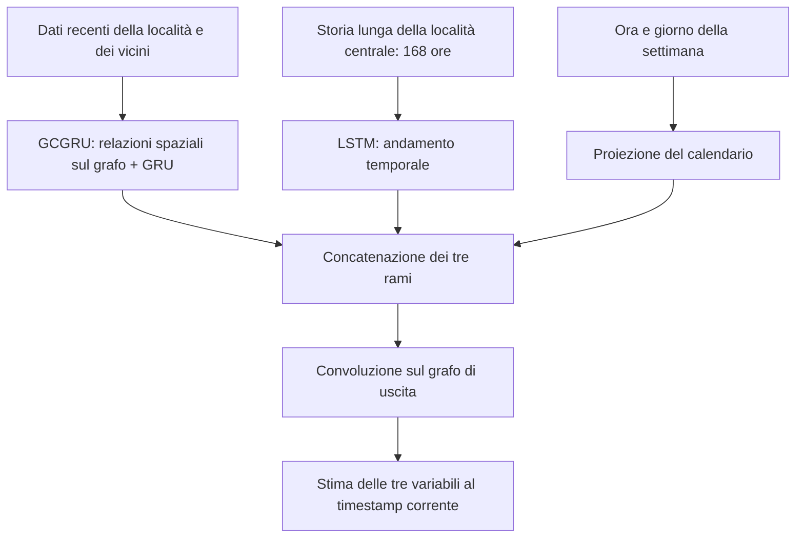

# STGAN: flusso della baseline e modifica CNN

STGAN è il **rilevatore di anomalie**: usa irradianza, temperatura e vento per
stimare quanto una situazione sia insolita. La previsione della produzione
fotovoltaica valutata con MAE/RMSE appartiene invece al modello SDE-Net.
Qui la baseline è l'implementazione GCN-GRU del progetto (`feat/stgan-paper`).

Il **generatore della baseline** combina tre rami:

Il flusso completo prosegue così:

1. **Preparazione:** normalizzazione stimata sul training e costruzione delle
   finestre temporali. La baseline usa la località centrale e otto vicini.
2. **Generatore:** produce i valori attesi di irradianza, temperatura e vento
   per le località della finestra, usando i tre rami sopra.
3. **Discriminatore:** riceve la storia recente insieme al dato corrente,
   reale oppure generato, e impara a distinguerli. Ha un encoder GCGRU per la
   storia e una convoluzione sul grafo per il dato corrente.
4. **Training congiunto:** il generatore impara sia a ricostruire i valori
   osservati sia a rendere plausibili le proprie stime al discriminatore.
5. **Score e decisione:** si combinano l'errore del generatore e la differenza
   fra le risposte del discriminatore al reale e al generato. Dopo la
   normalizzazione dei due contributi, il top-1% globale identifica le anomalie.

**La variante CNN cambia l'elaborazione spaziale.** Nel codice attuale è una
**ConvGRU**: conserva i meccanismi della GRU, ma usa convoluzioni 2D sulla
griglia geografica al posto delle convoluzioni sul grafo.

I file del modello si trovano in `physiq_pv/anomaly_detection/stgan/`.
**I link aprono la versione CNN attuale**; per la baseline gli stessi nomi
vanno cercati nel branch `feat/stgan-paper` (riferimento `777df6bc`).
`graph.py` appartiene alla baseline; la CNN usa `grid.py`.

| Blocco | Baseline | Variante CNN attuale | File e punto da cercare |
|---|---|---|---|
| Contesto spaziale | Centro + 8 vicini, con grafo | Finestra geografica 3×3, con maschera delle celle presenti | Baseline: `graph.py`, `build_geographical_subgraphs`; CNN: [grid.py](../physiq_pv/anomaly_detection/stgan/grid.py), `build_spatial_grid` |
| Ramo recente del generatore | GCGRU | **ConvGRU** | [model.py](../physiq_pv/anomaly_detection/stgan/model.py), `STGANGenerator.recent_encoder`; classi `GCGRU` / `ConvGRU` |
| Ramo lungo del generatore | LSTM sulle 168 ore | LSTM sulle 168 ore | [model.py](../physiq_pv/anomaly_detection/stgan/model.py), `STGANGenerator.trend_encoder` |
| Calendario | Ora + giorno della settimana | Stesso blocco | [data.py](../physiq_pv/anomaly_detection/stgan/data.py), `calendar_features`; [model.py](../physiq_pv/anomaly_detection/stgan/model.py), `STGANGenerator.time_projection` |
| Fusione dei tre rami | Concatenazione | Concatenazione | [model.py](../physiq_pv/anomaly_detection/stgan/model.py), `STGANGenerator.forward` |
| Uscita del generatore | Convoluzione sul grafo | **Convoluzione 1×1** | [model.py](../physiq_pv/anomaly_detection/stgan/model.py), `STGANGenerator`: `output_graph` / `output_projection` |
| Storia nel discriminatore | GCGRU | **ConvGRU** | [model.py](../physiq_pv/anomaly_detection/stgan/model.py), `STGANDiscriminator.sequence_encoder` |
| Dato corrente nel discriminatore | Convoluzione sul grafo | **Convoluzione 1×1**, con maschera | [model.py](../physiq_pv/anomaly_detection/stgan/model.py), `STGANDiscriminator`: `current_graph` / `current_projection` |
| Risposta finale del discriminatore | Unisce storia e dato corrente | Stessa struttura | [model.py](../physiq_pv/anomaly_detection/stgan/model.py), `STGANDiscriminator.forward` e `output` |
| Criterio di training e score | Ricostruzione + confronto avversario | Stesso criterio, calcolato sulle celle valide | [pipeline.py](../physiq_pv/anomaly_detection/stgan/pipeline.py), `fit_and_score_stgan`; [model.py](../physiq_pv/anomaly_detection/stgan/model.py), `STGAN.components` |

Ai bordi, la finestra CNN può avere meno vicini osservati; le celle assenti
sono mascherate. Con il default di **un solo passo recente**, la ConvGRU
esegue un aggiornamento: la memoria lunga rimane nel ramo LSTM.

**Dopo il detector**, il notebook posthoc applica il filtro qualità PVGIS:
esclude gli azzeramenti solari regionali anomali e l'ora successiva, ricalcola
il top-1% sui punti validi e associa le etichette alle previsioni SDE-Net.
È questo passaggio che alimenta i grafici MAE/RMSE quality filtered; non è
un blocco interno della CNN.

Per trovare anche i **passaggi esterni al modello**:

| Passaggio | File e punto da cercare |
|---|---|
| Preparazione dei CSV PVGIS | [scripts/prepare_pvgis_stgan.py](../scripts/prepare_pvgis_stgan.py), `main` |
| Caricamento dati e finestre recenti/lunghe | [data.py](../physiq_pv/anomaly_detection/stgan/data.py), `load_aligned_manifest_cubes` e `STGANWindowDataset` |
| Normalizzazione delle variabili sul training | [pipeline.py](../physiq_pv/anomaly_detection/stgan/pipeline.py), `_feature_minmax` |
| Ranking top-1% ed esportazione risultati | [scripts/run_pvgis_stgan.py](../scripts/run_pvgis_stgan.py), `paper_top_k_ranking` e `run_stgan` |
| Parametri CNN, incluso kernel 1 o 3 | [config.py](../physiq_pv/anomaly_detection/stgan/config.py), `STGANCNNConfig`; cella di configurazione del [workflow CNN](../notebooks/stgan_cnn_pvgis_workflow.ipynb) |
| Filtro qualità, nuovo ranking e join con SDE-Net | [pointwise_detector_posthoc.py](../physiq_pv/reporting/pointwise_detector_posthoc.py), `detect_isolated_regional_solar_dropouts`, `_rerank_clean_top_k`, `build_pointwise_detector_evaluation` |
| Nuovi grafici MAE/RMSE per condizione meteorologica | [stgan_meteo_errors.py](../physiq_pv/reporting/stgan_meteo_errors.py), `build_stgan_meteo_errors`, richiamata dal [posthoc](../notebooks/stgan_pointwise_posthoc_sdenet.ipynb) |

Riferimenti: [workflow CNN](../notebooks/stgan_cnn_pvgis_workflow.ipynb),
[posthoc](../notebooks/stgan_pointwise_posthoc_sdenet.ipynb),
[dettagli tecnici](STGAN_CNN_EXPERIMENT.md).
